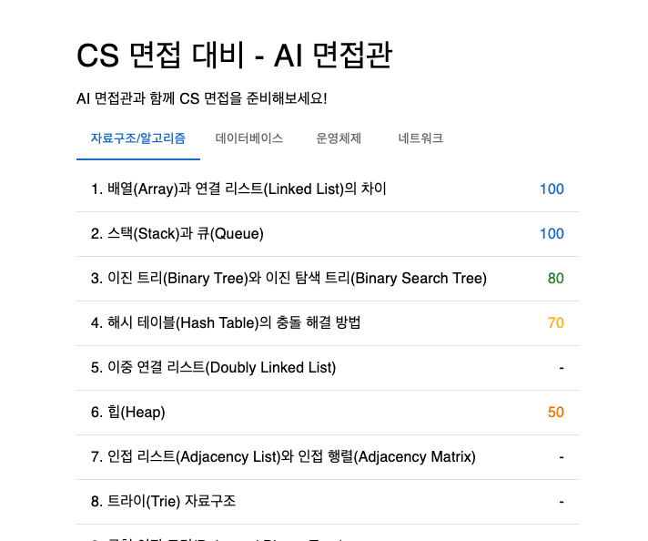
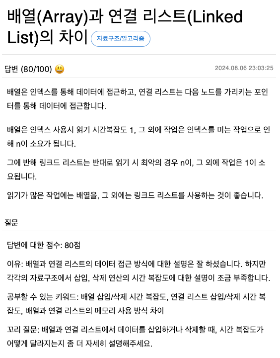
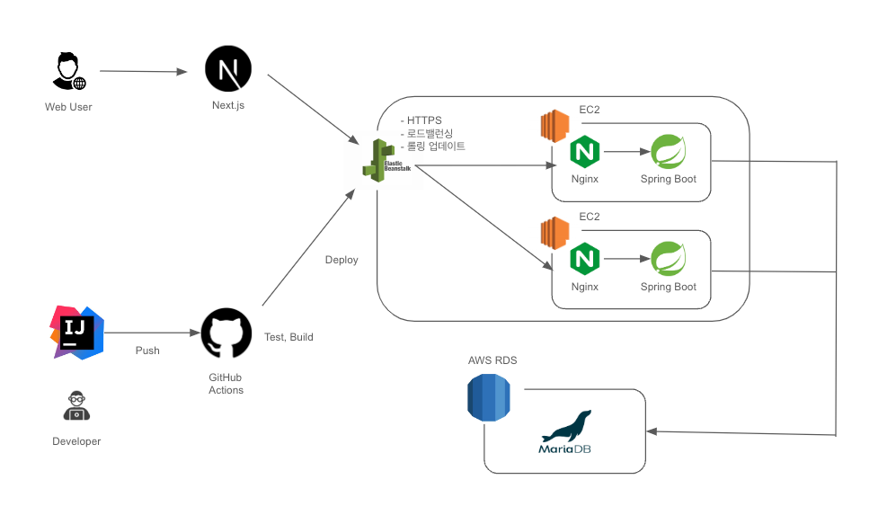

# cs-ai-interviewer

CS 면접을 준비하는 사람들을 위한 인터뷰 질문을 제공하는 서비스입니다.

### 이미지






### 서버 구조



### 패키지 구조

```
├── README.md
├── src/main/kotlin/dev.jxmen.cs.ai.interviewer
│   ├── application - Applicatoin 레이어. 유즈 케이스 등이 포함됩니다.
│   │   ├── adpater - 유즈케이스 인터페이스 구현체
│   │   ├── port - 유즈케이스 인터페이스
│   ├── common - 공통적으로 사용되는 코드가 포함됩니다. (예: Exception, Enum, Configuration 등)
│   ├── domain - 핵심 도메인입니다. (단, 아직 일부 코드는 Jpa Entity를 그대로 사용하고 있습니다.)
│   ├── persistence - 영속성 어댑터, Jpa Repository, Datbase Entity 등이 포함됩니다.
│   ├── presentation - RestController, Request, Response 등이 포함됩니다.
│   CsAiInterviewerApplication.kt - Spring Boot Application
```

- 패키지 구조는 [만들면서 배우는 클린 아키텍처](https://m.yes24.com/Goods/Detail/105138479) 책에서 영감을 받고, 일부를 재구성하였습니다.
  - `adapter/input` -> `presentation`
  - `adapter/output/persistence` -> `persistence`
- `domain` 패키지는 일부 Jpa Entity를 그대로 사용하고 있습니다. 추후 핵심 도메인과 Jpa Entity를 분리할 예정입니다.

### Swagger API 문서

https://cs-ai-api.jxmen.dev/swagger-ui/index.html

### ERD

To be updated
